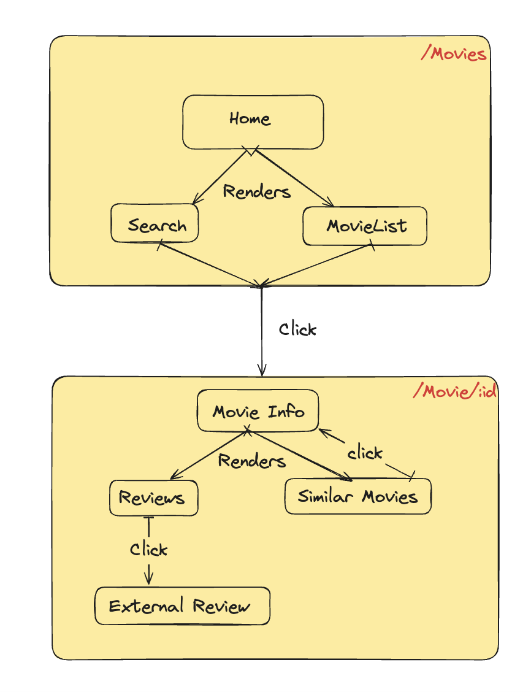

# Movie Database

## How to run

- Clone [repository](https://github.com/Squad1991/movie-database.git)
- `cd cloned-dir`
- `yarn install`
- `yarn start`
- Visit [localhost:1234](http://localhost:1234))

### Important commands

- `yarn test` Run tests
- `yarn lint` Executes eslint
- `yarn format` Formats all files using prettier
- `yarn type-check` Runs typescript checks

## Folder Structure

```
├── src
|   ├── assets      - Contains static assets like img, logo etc
│   ├── components  - Contains the components
│   |   ├──common   - Contains common reusable components
│   ├── routes      - Contains all route level configuration and components
│   ├── hooks       - Contains react custom hooks
│   ├── typings     - Contains custom global types used in tests and app
│   └── utils       - Contains utility function
└── App.tsx
└── README.md
```

## Dependencies

- Packaging
  - [yarn v1.22.19](https://yarnpkg.com/)
  - [husky](https://typicode.github.io/husky/)
  - [Node v18.18.1](https://nodejs.org/en)
- Styling
  - [Compiled react](https://compiledcssinjs.com/)
- Testing
  - [vitest](https://vitest.dev/)
- Icons
  - [React icons](https://react-icons.github.io/)
- Third party components
  - [React select](https://react-select.com/)
  - [React skeleton](https://www.npmjs.com/package/react-loading-skeleton)
  - [React tooltip](https://www.npmjs.com/package/rc-tooltip)
- Bundling
  - [Parcel](https://parceljs.org/)
- Typing
  - [Typescript](https://www.typescriptlang.org/)

## App Navigation

.

### Home Page:

- Search Bar: Allows users to input search queries to search movie.
- Movie List: Displays a list of movies (popular movies by default).
- Movie Cards: Each movie in the list is represented by a card. Clicking on a movie card redirects to the Movie Info Page.

### Movie Info Page:

- Movie Details: Shows detailed information about the movie (title, synopsis, cast, etc.).
- Reviews Section: Displays reviews for the movie. Each review card can be clicked to open the review on an external site in a new tab.
- Similar Movies: Displays a list of similar movies. Clicking on a similar movie card updates the Movie Info Page with information about the selected movie.

## Unit testing

All unit tests reside inside `(component|feature|utils)/__tests__` folder. For unit testing, wherever there is pure component a simple snapshot test is added.

## E2E

To be implemented
